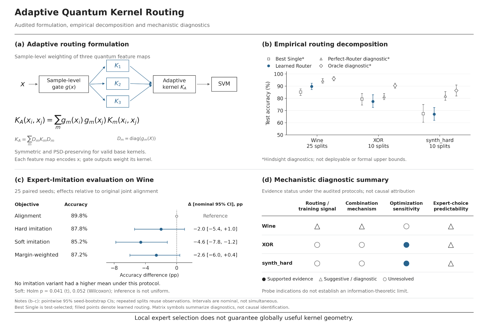
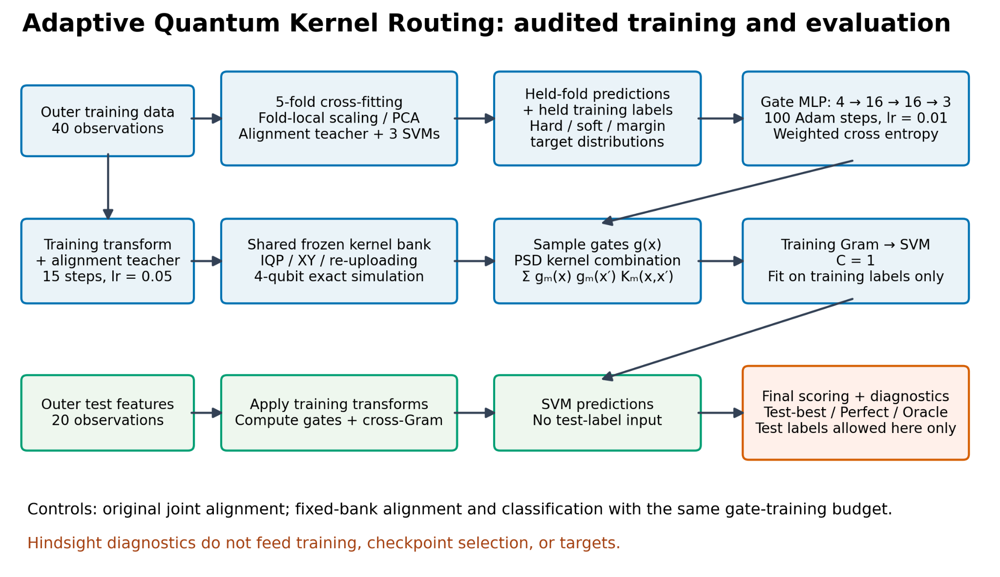
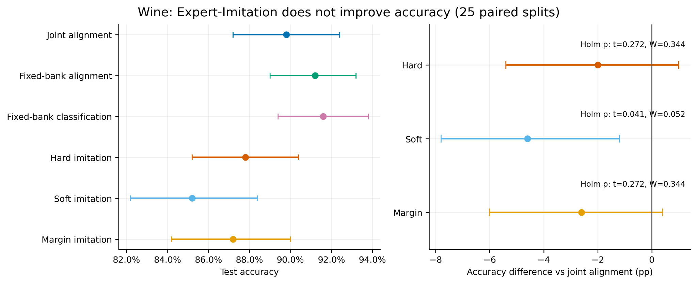

# Adaptive Quantum Kernel Routing

**Audited research project on adaptive quantum-kernel routing, local expert selection, and global kernel geometry.**

This repository investigates whether a learned router can combine multiple quantum kernels at the sample level and outperform the best individual kernel while preserving the mathematical structure required by kernel methods.

The central question evolved from:

> Can the router choose the correct expert?

to:

> Can local routing decisions be organized into a coherent, well-conditioned kernel geometry that improves the final classifier?

The project emphasizes leakage-safe evaluation, reproducibility, negative-result analysis, and mechanism-level diagnostics rather than headline performance claims.

<p align="center">
  
</p>

---

## Overview

The system uses a sample-level gate to produce nonnegative mixture weights across three structurally different quantum kernels:

```text
Input sample
   ↓
Sample-level router / gate
   ↓
K1 · K2 · K3
   ↓
PSD-preserving adaptive Gram matrix
   ↓
Precomputed-kernel SVM
```

For a sample `x`, the gate outputs:

```text
g(x) = [g1(x), g2(x), g3(x)]
gm(x) >= 0
Σm gm(x) = 1
```

The adaptive kernel is:

```text
KA(xi, xj) = Σm gm(xi) gm(xj) Km(xi, xj)
```

and on the training set:

```text
KA = Σm Dm Km Dm
```

where `Dm = diag(gm(x1), ..., gm(xn))`.

This construction preserves symmetry and positive semidefiniteness when the component kernels are PSD.

---

## Audited Training and Evaluation

The current pipeline uses fold-local preprocessing and out-of-fold target construction so that outer-test information does not enter router training.

<p align="center">
  
</p>

The three kernel families are:

- **Kernel 1 — IQP-style feature map:** Hadamard gates, RZ encoding, feature-product interactions, and ring entanglement.
- **Kernel 2 — Combined-axis star feature map:** `RY(x)` + `RX(x)` encoding with star-shaped entanglement.
- **Kernel 3 — Trainable re-uploading feature map:** repeated encoding, trainable local rotations, and trainable Ising-ZZ interactions.

A later audit found that the final local trainable block in the historical Kernel 3 is inactive under noiseless fidelity because the final input-independent unitary cancels. Historical results are therefore preserved separately from the corrected design.

---

## Leakage-Safe Expert Imitation

Expert-Imitation was introduced to directly supervise the router with out-of-fold expert behavior.

Targets are generated entirely inside the outer-training set:

```text
Outer training set
   ↓
Inner cross-fitting
   ↓
Fold-local preprocessing
   ↓
Train quantum teacher + expert SVMs
   ↓
Predict held-out fold
   ↓
Construct hard / soft / margin-weighted targets
```

No outer-test feature or label enters target generation.

Three target families were evaluated:

- **Hard imitation** — choose the correct expert with the largest positive signed margin.
- **Soft imitation** — distribute probability uniformly over all correct experts.
- **Margin-weighted imitation** — normalize positive signed margins over correct experts.

---

## Main Audited Result

The primary Wine evaluation used **25 paired outer splits**, five inner folds, four qubits, an exact statevector backend, and a precomputed-kernel SVM.

| Method | Mean test accuracy | Difference vs original alignment |
|---|---:|---:|
| Original joint alignment | 89.8% | — |
| Matched fixed-bank alignment | 91.2% | +1.4 pp |
| Matched fixed-bank classification surrogate | 91.6% | +1.8 pp |
| Hard imitation | 87.8% | -2.0 pp |
| Soft imitation | 85.2% | -4.6 pp |
| Margin-weighted imitation | 87.2% | -2.6 pp |

**No Expert-Imitation variant improved on the audited alignment baseline.**

<p align="center">
  
</p>

This negative result is retained as a research result rather than reframed as a success.

---

## Mechanistic Findings

### Better local expert selection did not guarantee a better adaptive kernel

Hard imitation achieved approximately:

- **98.7%** training agreement with OOF target identities
- **84.4%** test top-one expert accuracy
- **87.8%** final combined-kernel accuracy

The main mechanistic finding is that better local expert selection did **not** automatically translate into better global kernel geometry.

### Perfect-Router headroom

On the 25-seed Wine cohort:

| Quantity | Mean accuracy |
|---|---:|
| Best Single | 85.2% |
| Learned alignment router | 89.8% |
| Perfect-Router diagnostic | 94.4% |
| Oracle diagnostic | 96.2% |

These are hindsight diagnostics, not theoretical upper bounds.

### Optimization stability

The optimization audit covered **576 runs** across:

- 2 datasets
- 3 fixed splits
- 8 initializations
- 3 learning rates
- 2 epoch budgets
- 2 training modes

Substantial restart sensitivity remained, including after freezing the kernel bank.

### Target stability

Phase 2 measured how leakage-free OOF routing targets changed when only the inner fold assignment changed.

Selected results:

- mean Fleiss kappa: **0.343**
- mean valid-target modal agreement: **0.762**
- fraction with modal agreement below 0.8: **50.0%**
- mean valid-target fraction: **0.960**

Target instability is therefore a plausible contributor to Expert-Imitation failure, but the current evidence does not establish it as the unique cause.

---

## Reproducibility and Audit

The repository was audited against stored experimental evidence rather than the historical narrative.

The audit covered:

- **38 historical JSON files**
- **25 Wine continuation seeds**
- **150 stored gate/kernel classifier predictions**
- **576 optimization runs**
- **30 nested diagnostic runs**
- statistical recalculation
- source/configuration manifests
- figure hashes
- regression tests

Historical outputs are preserved, and provenance limitations are documented instead of reconstructed or inferred.

---

## Current Scientific Position

The evidence currently supports:

- the sample-level adaptive construction is symmetric and PSD-preserving
- the quantum kernels are structurally complementary
- complementarity does not automatically produce adaptive-routing improvement
- leakage-free Expert-Imitation did not improve Wine under the audited 25-seed protocol
- better local expert imitation can coexist with worse combined-kernel accuracy
- optimization sensitivity is substantial on XOR and `synth_hard`
- expert-choice predictability is weak or inconsistent under the tested probes
- OOF routing targets are meaningfully sensitive to fold assignment
- the historical Kernel 3 contains inactive parameters under noiseless fidelity

The project does **not** claim:

- quantum advantage
- hardware advantage
- general cross-dataset superiority
- that target instability is the unique cause of failure
- that adaptive routing is fundamentally impossible

---

## Phase 2

Current and planned work includes:

- nested kernel normalization and SVM regularization
- corrected Kernel 3 validation
- classifier-matched routing objectives
- global-consistency diagnostics connecting routing behavior to eigenspectrum, effective rank, condition number, SVM margin, and held-out accuracy

The highest-value next experiment is designed to distinguish between two explanations:

1. unstable teacher targets prevent learning the right local choices
2. accurate local choices still fail to generate globally useful kernel geometry

---

## Tech Stack

`Python 3.12` · `PyTorch` · `PennyLane` · `NumPy` · `SciPy` · `scikit-learn` · `Matplotlib` · `pytest`

---

## Status

**Research ongoing.**

Adaptive quantum-kernel routing is mathematically valid and the component kernels are complementary, but the present objectives do not reliably convert local expert information into a globally useful kernel for the downstream SVM.

---

## Contact

Feedback, replication attempts, and technical discussion are welcome.
